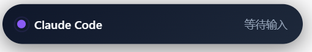
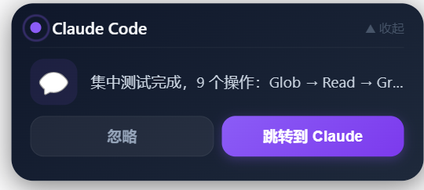
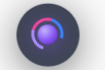

<h1 align="center">Claude Island</h1>
<p align="center">
  <strong>Dynamic Island for Claude Code</strong><br/>
  iPhone style notifications — never miss a waiting prompt
</p>

<p align="center">
  <br/>
  <sub>Collapsed — real-time tool tracking</sub>
</p>

<p align="center">
  <br/>
  <sub>Expanded — details + jump to Claude</sub>
</p>

<p align="center">
  <br/>
  <sub>Minimized — spinning gem dot</sub>
</p>

---

## What is this?

When you use Claude Code in CMD or VS Code, you often switch to a browser or other apps. Claude finishes and waits for your input, but you don't notice.

**Claude Island** shows a floating notification at the top of your screen:
- Real-time tool tracking (editing, reading, searching, running commands)
- Auto-expand when Claude needs your attention
- One click to jump back to the correct window (CMD or VS Code)
- Three states: collapsed pill, expanded card, minimized dot

## Quick Start

### 1. Clone and install

```bash
git clone https://github.com/0xxue/claude-island.git
cd claude-island
npm install
```

### 2. Setup Claude Code hooks

```bash
node install/setup-hooks.js
```

This automatically configures `~/.claude/settings.json` to send events to Claude Island.

### 3. Start Claude Island

**Important:** On Windows, you must start it outside VS Code terminal (because VS Code sets `ELECTRON_RUN_AS_NODE=1`). Use one of these methods:

**Method A: PowerShell (recommended)**
```powershell
cd claude-island
$env:ELECTRON_RUN_AS_NODE = $null
.\node_modules\electron\dist\electron.exe .
```

**Method B: Create a start script**
```bash
# Create start.bat in the project root
echo @echo off > start.bat
echo set ELECTRON_RUN_AS_NODE= >> start.bat
echo node_modules\electron\dist\electron.exe . >> start.bat
```
Then double-click `start.bat`.

### 4. Use Claude Code normally

Open Claude Code in CMD or VS Code. Claude Island will automatically show notifications.

## Features

### Three States

| State | How to enter | What it shows |
|-------|-------------|---------------|
| **Collapsed** (default) | Single click dot, or auto on event | Tool name + status text |
| **Expanded** | Single click collapsed, or auto on permission | Details + Dismiss/Jump buttons |
| **Dot** | Double click collapsed/expanded | Spinning gem animation |

### Interactions

| Action | Effect |
|--------|--------|
| **Single click** | Cycle: dot → collapsed → expanded → collapsed |
| **Double click** | Minimize to dot |
| **Triple click** | Recenter to default position |
| **Drag** | Move anywhere on screen |
| **"Jump to Claude"** | Focus the correct window (CMD or VS Code) |
| **"Dismiss"** | Minimize to dot |

### Auto-expand

| Scenario | Behavior |
|----------|----------|
| Permission request | Always auto-expand (even from dot) |
| Claude waiting + you're away from editor | Auto-expand |
| Claude waiting + you're in editor | Stay collapsed |
| Tool running | Update text, stay collapsed |

### Smart Window Focus

Claude Island detects whether Claude Code is running in CMD or VS Code, and jumps to the correct window when you click "Jump to Claude".

## How It Works

```
Claude Code (CMD / VS Code)
    |
    |  ~/.claude/settings.json hooks
    |  (PreToolUse / PostToolUse / Stop / PermissionRequest)
    v
bridge.js (lightweight CLI, spawned per event)
    |
    |  WebSocket ws://127.0.0.1:19432
    v
Claude Island (Electron app)
    |
    |  Floating transparent window
    v
Screen top — Dynamic Island notification
```

### Hooks

| Hook | What it does |
|------|-------------|
| `PreToolUse` | Show "editing..." / "reading..." / "searching..." |
| `PostToolUse` | Show "done" with checkmark |
| `Stop` | Show "waiting for input" |
| `PermissionRequest` | Auto-expand "needs approval" |
| `Notification` | Show notification content |
| `SessionStart` | Hide island |
| `SessionEnd` | Hide island |

## Project Structure

```
claude-island/
├── src/
│   ├── main.js              # Electron main process
│   ├── preload.js            # IPC bridge
│   ├── ws-server.js          # WebSocket server (port 19432)
│   ├── window-focus.js       # Smart window activation
│   ├── check-focus.ps1       # Detect foreground window
│   ├── detect-source.ps1     # Detect CLI vs VS Code
│   └── island/
│       ├── index.html        # Island UI
│       ├── styles.css        # Animations & states
│       └── app.js            # State machine & event handling
├── bridge/
│   └── bridge.js             # Hook bridge CLI
├── install/
│   └── setup-hooks.js        # Auto-configure Claude Code hooks
├── package.json
└── README.md
```

## Requirements

- Node.js 18+
- Claude Code CLI installed
- Windows 10/11 (macOS support planned)

## Troubleshooting

**Island doesn't appear:**
- Make sure Electron is not running as Node (`ELECTRON_RUN_AS_NODE` must be unset)
- Check that hooks are configured: `cat ~/.claude/settings.json | grep bridge`

**Jump goes to wrong window:**
- This can happen when multiple Claude Code sessions run simultaneously
- The island tracks the most recent stop/permission event's source

**Island too big/small:**
- Adjust `WIN_W` and `WIN_H` in `src/main.js`
- Your display scaling (DPI) affects the visual size

## License

MIT
